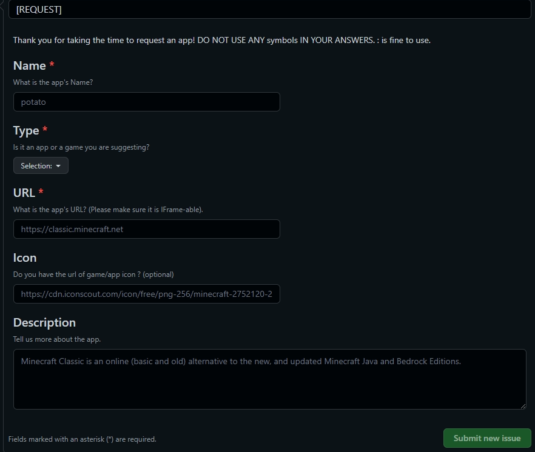

  Please make sure that your chosen app/game supports IFrame. You can check if
  your app or game supports iframe using this free IFrame checker.


# 🎮 Add An App to the Store.

## How to add an app to the store.

There are two ways to add an app to the store

### Using GitHub Issues.

Create an [issue](https://github.com/win11react/store/issues/new?assignees=andrewstech\&labels=request\&template=app\_request.yml\&title=%5BREQUEST%5D) and fill in the boxes.



### Using GitHub Pull Requests.

Create a Pull Request by editing the [store.json](https://github.com/win11react/store/blob/main/store/index.json) file.


!>**Important:  Read the Below Schema before editing the store.json file.**
```json
{
  "name": "Minecraft", // unique name (check if it has been used already in the file)
  "icon": "https://example.com/minecraft.png", // logo image, preferrably 1:1 and less than 128px of width
  "type": "game", // game or app
  "data": {
    "type": "IFrame", // type currently supports IFrame only
    "url": "https://classic.minecraft.net", // url of the app and make sure they accept Iframe
    "gallery": [
      // three or more images for gallery view in store app
      "https://www.minecraft.net/content/dam/games/minecraft/key-art/CavesandCliffsPt1-dotNET-HomepagePromo-600x360.png",
      "https://variety.com/wp-content/uploads/2019/02/minecraft-best-year-yet.png?w=600",
      "https://www.minecraft.net/content/dam/games/minecraft/screenshots/RayTracing-MineCraft-PMP-Always-Something-New.jpg"
    ],
    "desc": "Minecraft is a sandbox construction video game ...", // description for store app
    "feat": "1.1 Combat changes.\n1.2 Fletching table functionality.", // features for store app
    "invert": true // when true it forces dark theme for game/app window, default is false.
  }
}
```


!>**Make sure to remove all comments from the store.json file.**


Comments look like this: `// example`

Add your Game/App to the file (There is no need to beautify the code) and make a pull request to get it _potentially_ accepted.

